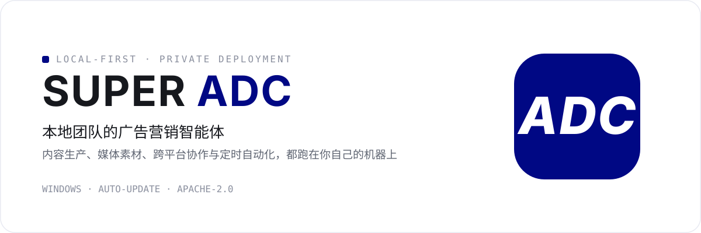
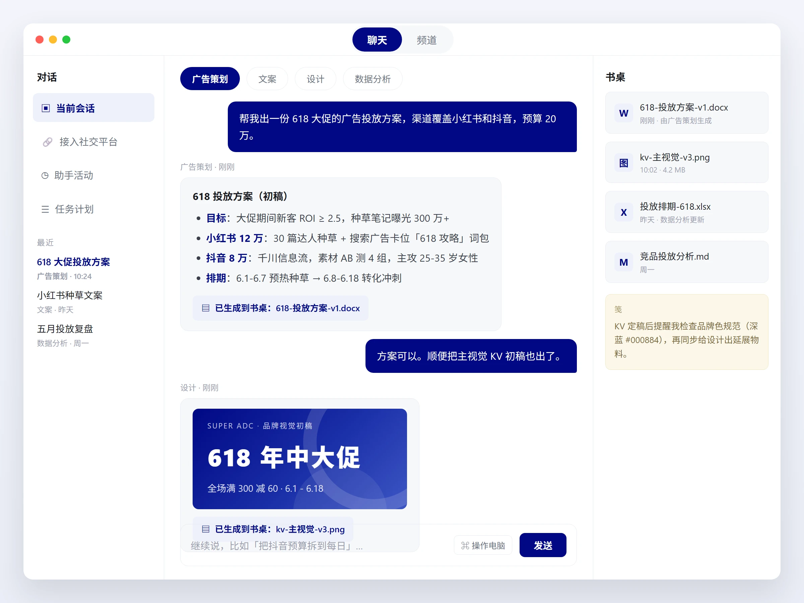

  

  <strong><a href="https://github.com/kiakun-collab/super-adc-releases/releases/latest">⬇ 下载最新版（Windows）</a></strong>
  · <a href="https://github.com/kiakun-collab/super-adc-releases/releases">全部版本</a>

> 安装包暂未签名，Windows SmartScreen 提示时选择「仍要运行」即可。安装后应用会自动更新到最新版。

## 它能做什么

- **做广告方案**：说出你的需求，直接产出投放方案、种草文案和复盘报告。
- **出营销素材**：KV 主视觉、配图、PPT 和 Word 文档，生成好直接放进书桌。
- **一个 Agent 团队**：策划、文案、设计、数据分析各司其职，各有专长和记忆。
- **连接你的平台**：接入飞书、微信、QQ、Telegram，手机上也能随时找到它。
- **定时自动干活**：定时任务、提醒和定期复盘，到点自动执行，结果主动找你。
- **跑在你电脑上**：所有数据留在本地，不必交给云端。

  

## 链接

- [项目源码](https://github.com/kiakun-collab/super-adc)
- [问题反馈](https://github.com/kiakun-collab/super-adc-releases/issues)
- 许可证：[Apache License 2.0](https://github.com/kiakun-collab/super-adc/blob/main/LICENSE)
